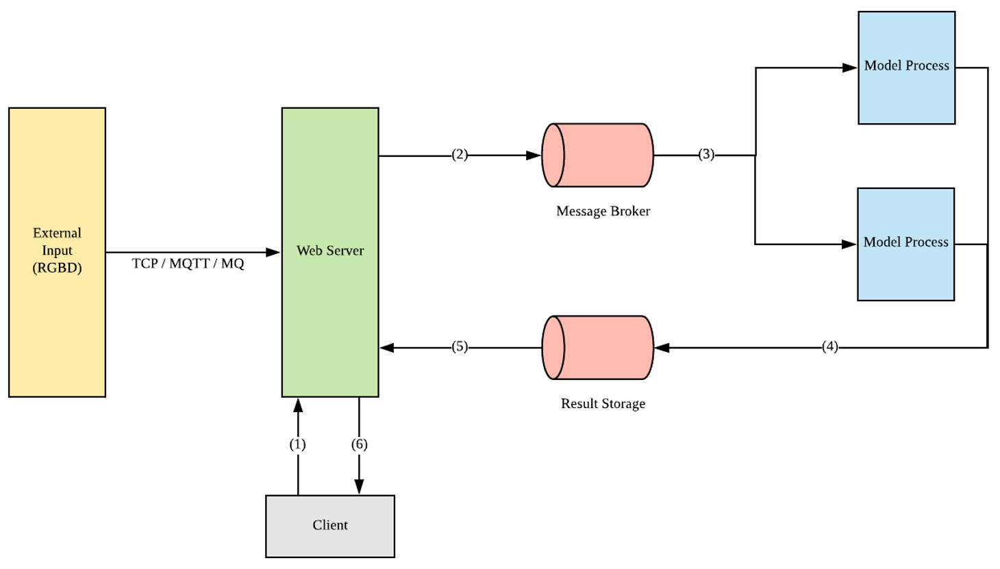
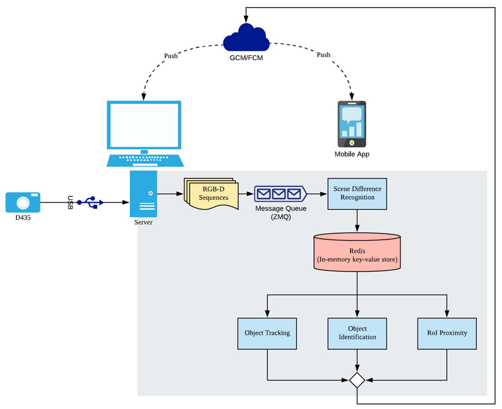
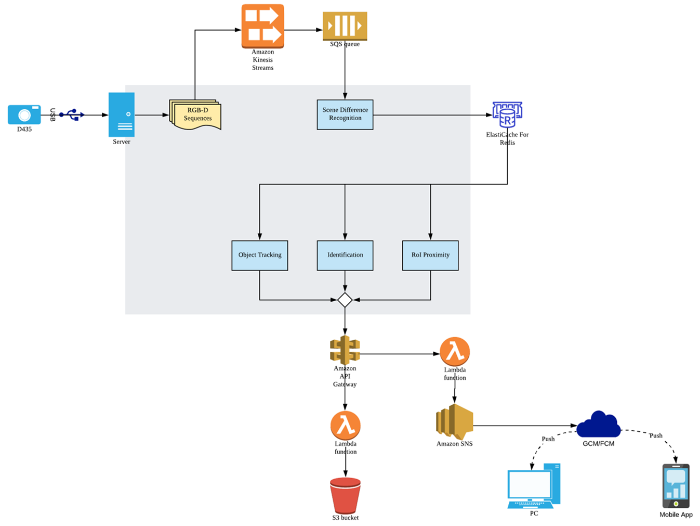
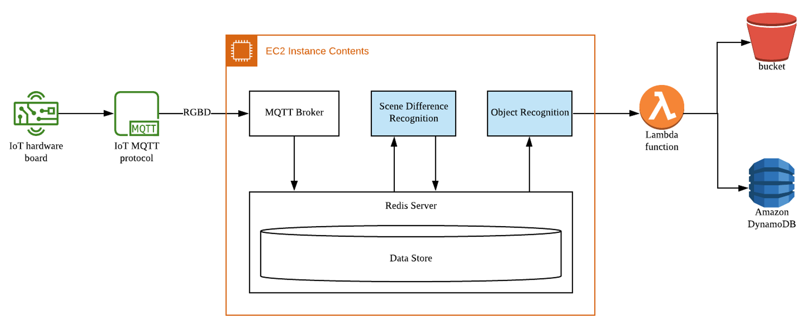
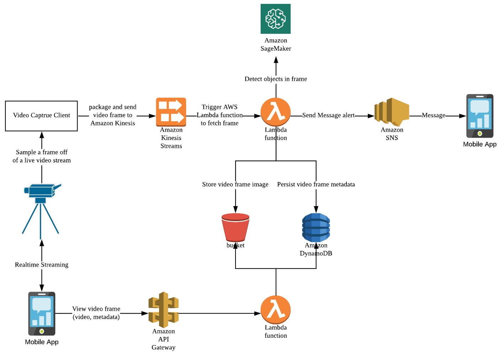

# Demo

Demo that receives rgbd data from D435 sensor, inference the data in server (AWS or Local PC), and pushes the result through FCM.

- RGBD data acquisition and transmission to server
- Scene Difference Recognition
- Object Detection
- Object Tracking (Identification)
- RoI Proximity
- FCM cloud messaging
- AWS (Kinesis, SQS, SNS, API Gateway, Lambda, DynamoDB, etc.)

## Result

## Architecture

