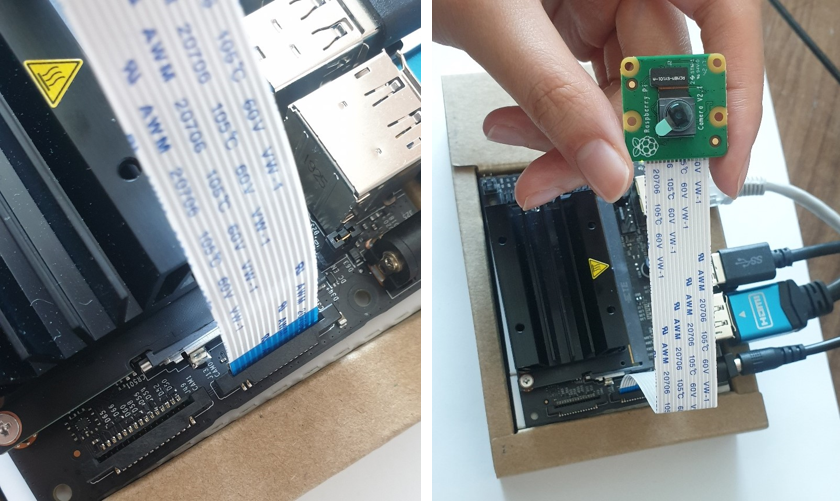

# RPi Camera

Jetson products usually support `MIPI-CSI` camera.
> `MIPI(Mobile Industry Processor Interface)` 
>
> : 모바일 기기의 내부 인터페이스. 프로세서와 주변 장치들 사이의 HW와 SW를 연결하는 Serial Interface 규격
> - 고속의 디지털 Serial Interface로, 아날로그 Interface에 비해 적용하기 쉽다.
> - 배터리 소모량을 줄이고 높은 대역폭을 통해 고속의 신호 전송이 가능

> `CSI(Camera Serial Interface)`
>
> : Camera를 Control 하는 Device는 I2C 버스를 사용해 카메라를 컨트롤하고, 카메라에서 촬영한 이미지는 S-LVDS를 통해 전달 받는다. 

> MIPI CSI-2는 현재 스마트폰 카메라 Interface를 위해 주로 사용하는 방식으로, Protocol Layer로 CSI-2를 사용하고 Physical Layer로는 D-PHY를 사용한다. 이 프로토콜은 Camera와 Host 장치 간의 고속 전송을 위한 것이다. 프로세서에 직접 연결되기 때문에 USB 연결보다 적은 오버헤드를 갖는다. 

Jetson nano has a connector compatible with RPi camera. A device driver of `IMX 291` is already installed and can be used by just connecting the camera. It is compatible with V2 RPi camera moddule not V1.



1. Open the `J13` camera connector
2. Insert the ribborn cable with the blue side facing out
3. Close the connector
4. Check the camera connection

```sh
ls -al /dev/video*

crw-rw----+ 1 root video 81, 0  4월 18 13:43 /dev/video0
```

You can check the device connection by `/dev/video`. It takes about 5 minuites in my case.

- GStreamer Test

```sh
gst-launch-1.0 nvarguscamerasrc ! nvoverlaysink
```

`Gstreamer` is used to interface with camera. Check the camera image is displayed in the window using above command.

```sh
gst-launch-1.0 nvarguscamerasrc ! 'video/x-raw(memory:NVMM),width=3820, height=2464, framerate=21/1, format=NV12' ! nvvidconv flip-method=0 ! 'video/x-raw,width=960, height=616' ! nvvidconv ! nvegltransform ! nveglglessink -e
```

# Notes

## v4l2-ctl

```sh
sudo apt install v4l-utils
```

Use `v4l2-ctl` for control when developing camera drivers.

```sh
v4l2-ctl -d /dev/video0 --list-formats-ext
```

Check supported image foramts and resolutions for specific devices.
